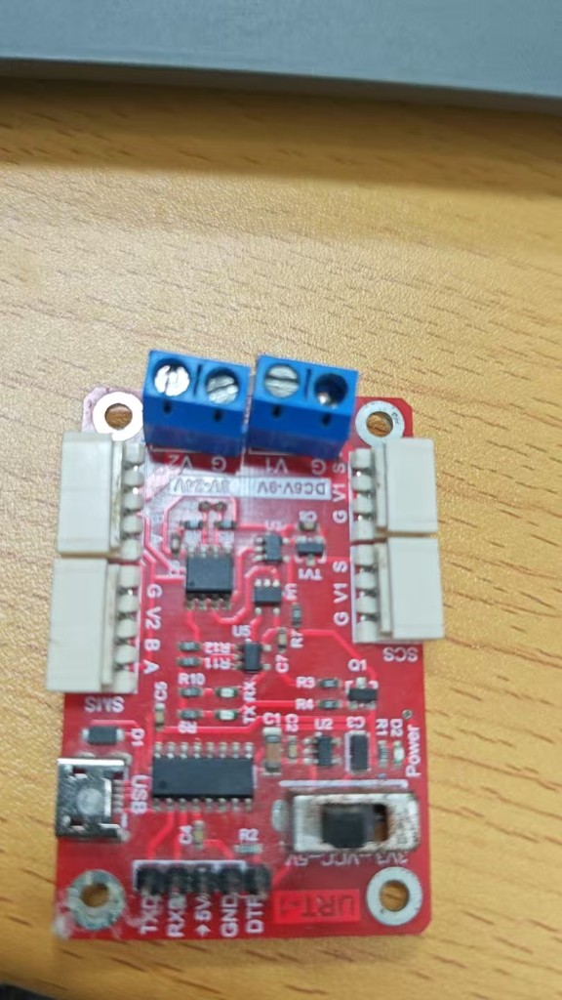

# 叶菜切割—清洗—打包一体机 · 电控系统

> 一台把「切根 → 清洗 → 计量 → 打包」串成连续动作的叶菜（小葱/大葱）初加工装备。本仓库是它的**电控与运动控制全部源码**：STM32F103VE 裸机 + FreeRTOS 实时控制、四路串口分工、总线舵机与步进电机混合驱动、串口屏人机界面，以及配套的三套上位机调试工具。

<p align="center">
  
</p>

**获奖**：2026 中国大学生机械工程创新创意大赛 · 智能装备创新设计赛 · 本科生组 **全国一等奖**
（作品名称：叶菜洁净净化处理包装一体化机械｜证书编号 `MEICC02IEIDC2026-JB1-038`｜中国机械工程学会）
同作品另获湖南省级竞赛主赛道叶菜组一等奖（湖南省教育厅）。

---

## 系统架构

```
                     ┌──────────────────────────────┐
                     │  上位机（视觉 / 调度）        │
                     │  香橙派 5 MAX · Jetson Orin   │
                     └───────────────┬──────────────┘
                                     │ USART2 @115200
                                     │ 自定义帧协议（0xAA … 0x55 / XOR）
                     ┌───────────────▼──────────────┐
                     │        STM32F103VE           │
                     │        FreeRTOS 双任务        │
                     │  Protocol Task │ Process Task │
                     └──┬────────┬────────┬─────────┘
        USART3 @115200  │        │        │  UART4（半双工总线）
     ┌──────────────────┘        │        └──────────────────┐
     ▼                           ▼                           ▼
┌──────────────┐      ┌─────────────────────┐      ┌──────────────────┐
│ TJC 串口屏    │      │ 步进电机 × N         │      │ 飞特总线舵机       │
│ 人机界面      │      │ 切割刀 / 同步带 / 丝杆│      │ SCS / SM40BL 叶轮 │
│ 启动·急停·计数│      │ + 限位开关 E0/E1      │      │ （清洗、打包机构） │
└──────────────┘      └─────────────────────┘      └──────────────────┘
                                     │
                     ┌───────────────┴──────────────┐
                     │ 传感器：超声波(物料) · HX711  │
                     │ 称重 · MPU6050 · 限位开关      │
                     └──────────────────────────────┘
```

### 四路串口分工

| 串口 | 引脚 | 接什么 | 说明 |
|------|------|--------|------|
| USART1 | PA9 / PA10 | 调试终端 + HX711 命令 | 打印称重、标定、日志输出 |
| USART2 | PA2 / PA3 | 上位机（香橙派 / Jetson） | 主控指令通道，自定义帧协议 |
| USART3 | PB10 / PB11 | TJC 串口屏 | 现场操作界面，`0x9A` 启动工艺 |
| UART4 | PC10 / PC11 | 飞特总线舵机 | 半双工总线，驱动叶轮机构 |

> 中断服务程序只负责往环形缓冲里塞字节，业务逻辑全部回到任务上下文处理——`USART3` 收到 `0x9A` 只置标志位，由主循环取走执行，避免在 ISR 里做阻塞发送。

---

## 工艺流程状态机

工艺全程由一个显式状态机驱动（`main.c` 的 `BSP_Tick_AppHook1ms()`，1ms 时基），跑满一个「检测 → 切根 → 推进 → 计量」循环后按计数触发清洗打包段：

```
   上电
    │
    ▼
 IDLE ──[串口屏 0x9A]──▶ BELT_RUN        同步带运转，超声波待料
    ▲                        │ 超声 < 5cm（计数 +1）
    │                        ▼
    │                    SCREW_REV        同步带停 + 丝杆反转（E1 限位 或 6s 超时）
    │                        │
    │                        ▼
    │                    CUT_RUN           切割电机 1.5s + 同步带跑满 8s
    │                        │
    │                        ▼
    │                    BELT_FWD          同步带正转推进
    │                        │
    │                        ▼
    │                    SCREW_FWD         丝杆正转（E0 限位 或 6s 超时）
    │                        │
    │                        ▼
    │                   BELT_RUN2 ──[计数未满]──▶ 回到 BELT_RUN
    │                        │ 计数达阈值
    │                        ▼
    │                  CONVEY_WAIT        等待 3s
    │                        │
    │                        ▼
    │            CONVEY_ENTER → CONVEY_REV（反转 4s）→ CONVEY_FWD（正转 20s）
    │                        │
    └────────────────────────┘
```

**每个动作都带超时兜底**：丝杆行程靠限位开关判定，但同时挂 6s 超时——限位开关失效时流程不会永久卡死，这是现场调试踩出来的教训。

---

## 通信协议

```
┌──────┬──────┬──────┬──────────┬──────┐
│ 0xAA │ CMD  │ LEN  │  DATA[]  │ 0x55 │
└──────┴──────┴──────┴──────────┴──────┘
  帧头    命令   长度    ≤32 字节    帧尾
                 （帧内另有 XOR 校验字节）
```

| 方向 | 命令 | 值 | 说明 |
|------|------|-----|------|
| 上位机 → STM32 | `CMD_PROCESS_START` | `0x30` | 启动工艺（实测帧 `AA 30 00 9A`，`0x9A` 为该帧 XOR） |
| 上位机 → STM32 | 速度 / 位置 / 舵机角度 | — | 见 [上位机通信协议.md](scallion-packer/project/上位机通信协议.md) |
| STM32 → 上位机 | 传感器数据 / 电机状态 / 限位 / 系统状态 / 任务完成 / 错误 | `0x01`–`0x06` | 周期上报 + 事件上报 |

协议细节、全部命令码与 TJC 串口屏的事件绑定见
[上位机通信协议.md](scallion-packer/project/上位机通信协议.md) 与
[TJC_HMI_事件与协议对照.md](scallion-packer/project/TJC_HMI_事件与协议对照.md)。

---

## 代码结构

驱动层全部按**对象化**写法组织（`bsp_xxx_obj.c/h`），每个外设是一个带函数指针表的结构体，业务层不直接碰寄存器：

```
scallion-packer/
├── project/                      # STM32 固件工程（Keil MDK, RVMDK uv5）
│   ├── User/
│   │   ├── main.c                # 主入口 + 1ms 时基钩子（工艺状态机在此）
│   │   ├── device.c/.h           # 设备级编排
│   │   ├── protocol/             # 帧协议 + 工艺控制（process_control.c）
│   │   ├── freertos/             # FreeRTOS 任务定义（Protocol / Process）
│   │   ├── stepper/              # 步进电机（脉冲/方向/使能 + 加减速）
│   │   ├── servo/                # 舵机：PWM 型 + 飞特半双工总线型
│   │   ├── dc_motor/             # 直流电机（TIM8 PWM）
│   │   ├── sensor/               # HX711 称重 / MPU6050 / 传感器对象层
│   │   ├── limit_switch/  relay/  gpio/  usart/  tick/  atim/
│   │   └── config/bsp_hardware_config.h   # 引脚与硬件配置集中定义
│   ├── Libraries/                # CMSIS + STM32F10x 标准外设库（ST 官方）
│   ├── Project/RVMDK（uv5）/      # Keil 工程文件 BH-F103.uvprojx
│   ├── 工艺流程说明.md            # 24KB，工艺分段与各段动作详述
│   ├── 继电保护设计.md            # 30KB，强电回路与保护设计
│   ├── 外设接线表_硬件PWM步进优化版_按模块.md
│   ├── 飞特总线舵机_单片机通讯方法.md
│   ├── 串口命令汇总表.md / 串口命令速查表.md
│   ├── Jetson部署指南.md          # 上位机换 Jetson Orin Nano 的接线与配置
│   └── README.md                 # 固件使用说明（含 API 参考、故障排查）
│
├── tools/                        # 上位机调试工具（Python）
│   ├── serial_plotter/           # HX711 称重曲线实时绘制 + 一键校准 + CSV 导出
│   ├── sm40bl_host/              # 飞特 SM40BL-C001 RS485 总线舵机控制台
│   └── scs_servo_host/           # 飞特 SCS 串口舵机控制台（PySide6 GUI）
│
├── system_block_diagram.svg      # 系统框图
└── simple_block_diagram.svg      # 简化框图
```

---

## 快速开始

### 固件（Keil MDK）

1. 打开 `scallion-packer/project/Project/RVMDK（uv5）/BH-F103.uvprojx`
2. 编译并下载到 STM32F103VE
3. 复位后 LED 心跳闪烁（500ms 翻转）表示 FreeRTOS 任务已启动

> `.gitignore` 已排除 `Output/`、`Listing/`、`*.uvoptx` 等编译产物与个人 IDE 配置。

### 上位机工具

```bash
cd scallion-packer/tools/serial_plotter
pip install -r requirements.txt
python main.py          # 打开串口即可看到重量曲线
```

三套工具互相独立。硬件侧提醒：`sm40bl_host` 走 **RS485 差分**，必须用 USB-RS485 转换器，普通 USB-TTL 直接接会通信失败；`scs_servo_host` 是**半双工单总线**，TX/RX 需经二极管与电阻汇合成一根信号线，**不能把 TX 与 RX 直接短接**。

### 上位机与 STM32 联调

接线（USB-TTL，3.3V 电平，务必共地）：

```
USB-TTL TX  →  STM32 PA3 (USART2_RX)
USB-TTL RX  →  STM32 PA2 (USART2_TX)
GND         →  GND
```

---

## 技术要点

**1ms 软时基调度**
`BSP_Tick_AppHook1ms()` 由定时器中断驱动，所有工艺段计时（切割 1.5s、同步带 8s、丝杆 6s 超时、传送带 20s）都是在这个 1ms 基上做软件分段，不占用额外硬件定时器。换工艺参数只改常量表，不动机器结构。

**双任务分工**
FreeRTOS 上跑 `Protocol`（收发与解析）与 `Process`（工艺推进）两个任务，串口互斥锁带 **超时**（`5ms`）而非 `portMAX_DELAY`——早期用无限等待，一旦某任务异常持锁，整个通信链路永久阻塞。改成超时后单次抖动不再拖垮系统。

**中断只做搬运，不做业务**
所有 USART 的 `OnRxByte` 只写入环形缓冲并置标志，解析与状态迁移在任务上下文完成。ISR 内不做阻塞发送，避免高优先级中断被长时间占用。

**上位机三件套是「可观测性」投入**
`serial_plotter` 把 HX711 的重量曲线实时画出来并能一键下发校准系数、导出 CSV——称重跳变、零漂这类问题靠肉眼看数字很难定位，画成曲线一眼就能看出是机械振动还是电噪声。这套工具在比赛现场排查故障时的价值不低于固件本身。

---

## 已知限制与技术债

如实记录，避免后来者重复踩坑：

- **`main.c` 1663 行，工艺状态机整个塞在 `BSP_Tick_AppHook1ms()` 一个函数里**。分段逻辑与硬件操作耦合，新增工艺段需要动这个巨型函数。合理方向是把每个工艺段抽成独立的 `step` 结构体（进入/退出/超时回调），用表驱动替换 `switch`。
- **`project/README.md` 已过时**：它描述的是重构前的目录（`motor/bsp_motor.c`、`servo/bsp_servo.c`），实际代码已拆成 `stepper/`、`dc_motor/`、`servo/bsp_servo_obj.c`；文中「需要选型」的表述写于硬件定型之前。**以本 README 与实际代码为准。**
- **版本号三处不一致**：`project/README.md` 标 V2.1、`main.c` 注释标 V5.0、`版本记录.txt` 标 `ver_01.00.00`。缺统一的版本来源。
- **`tools/*/main.py` 三个工具同名**，无法在同目录下同时以模块方式导入，只能各自 `cd` 进去运行。
- **`bsp_hx711.h` 的 include 在 `main.c` 中被注释掉**，称重功能当前通过 USART1 命令路径使用，未接入工艺状态机的闭环判断。
- **引脚分配表在两个文档里各有一份**（`project/README.md` 与 `外设接线表_*.md`），曾出现舵机 3/4 与 OLED 引脚冲突、限位开关与 TIM8 冲突。引脚应以 `User/config/bsp_hardware_config.h` 为唯一事实来源。

---

## 文档索引

| 文档 | 内容 |
|------|------|
| [工艺流程说明.md](scallion-packer/project/工艺流程说明.md) | 工艺分段、各段动作与时序（24KB） |
| [继电保护设计.md](scallion-packer/project/继电保护设计.md) | 强电回路、保护设计（30KB） |
| [上位机通信协议.md](scallion-packer/project/上位机通信协议.md) | 完整帧协议与命令码 |
| [TJC_HMI_事件与协议对照.md](scallion-packer/project/TJC_HMI_事件与协议对照.md) | 串口屏控件 ↔ 命令对照 |
| [外设接线表_硬件PWM步进优化版_按模块.md](scallion-packer/project/外设接线表_硬件PWM步进优化版_按模块.md) | 按模块的接线明细 |
| [飞特总线舵机_单片机通讯方法.md](scallion-packer/project/飞特总线舵机_单片机通讯方法.md) | SCS / SM40BL 总线协议 |
| [Jetson部署指南.md](scallion-packer/project/Jetson部署指南.md) | 上位机替换为 Jetson Orin Nano |
| [串口命令速查表.md](scallion-packer/project/串口命令速查表.md) | 现场调试用命令速查 |
| [流程图.html](scallion-packer/project/流程图.html) | 工艺流程图（浏览器打开） |

---

## 团队与致谢

**参赛团队**：易楚琦、杨锦成、刘水生
**指导教师**：陈星光、杨启正、王琳
**参赛单位**：湖南交通工程学院

本项目电控系统（STM32 固件、上位机工具、通信协议）由团队成员自主开发。

---

## 第三方与许可

- 本项目自有代码以 [MIT](LICENSE) 许可开源。
- `project/Libraries/` 下的 CMSIS 与 STM32F10x 标准外设库版权归 **STMicroelectronics**，遵循其原有许可（MCD-ST Liberty SW License Agreement V2），不适用本项目的 MIT 条款。
- `tools/` 中飞特舵机的协议帧格式依据厂商公开的《舵机协议手册》整理，协议本身归飞特所有。
